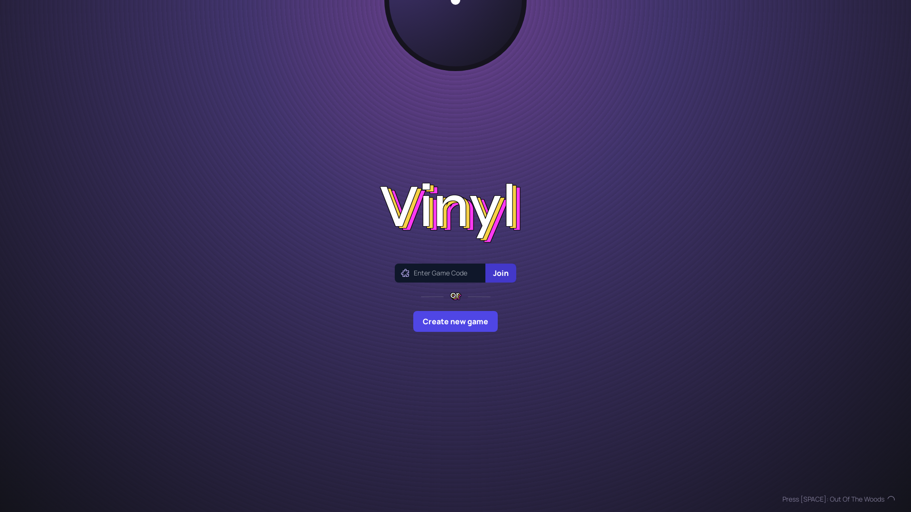

 

# About

Vinyl is a multiplayer song guessing game inspired by the famous online multiplayer game, [skribbl](http://skribbl.io/)

# How to Play

Playing vinyl is easy and simple. All you need to do is:

1. Create a room 🏠
2. Invite some friends (using the invite link) 💌
3. Choose your Spotify playlist (or from our Handpicked ones )🤌🏽
4. Choose the number of rounds 🔢
5. Guess the song before everyone else 🏆

(<a href="#top">back to top</a>)

# Bug report or Feature request

If you encounter a bug or have a feature request, [send us an email](mailto:roy.arijit2001@gmail.com), [create an issue](https://github.com/radioactive11/vinyl/issues), [create a discussion thread](https://github.com/radioactive11/vinyl/discussions)

# Want to Contribute?

Refer to [CONTRIBUTING.md](./CONTRIBUTING.md).

# Code of Conduct

Before contributing to this repository, please read the [code of conduct](./CODE_OF_CONDUCT.md).

